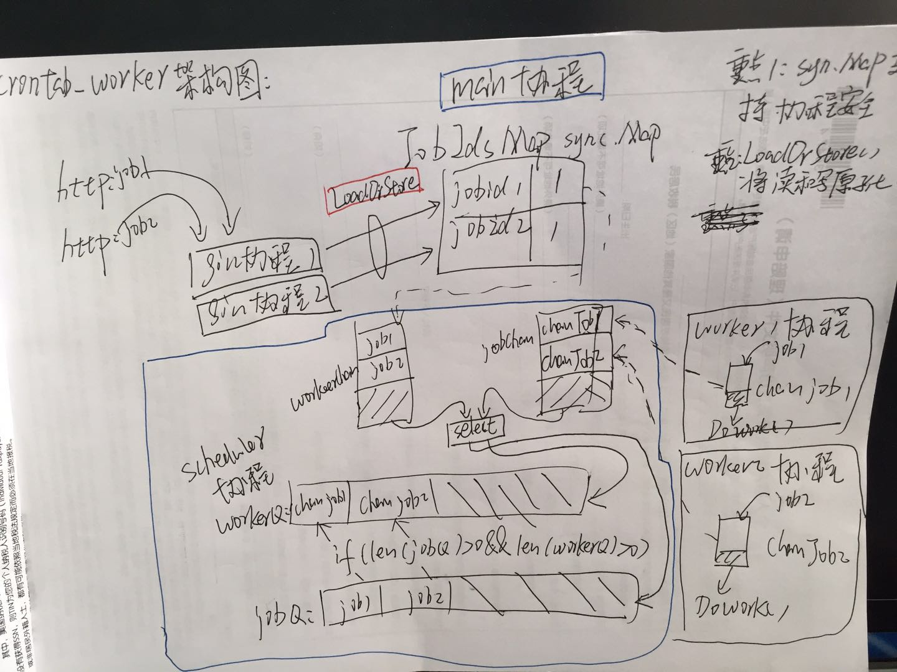

### Introduction
----
version 1：
单机多协程执行器

### Features
----
* 同任务不能并发
* 不同任务可以并发
* 限制并发数
* http请求后立刻返回成功http 200,golang去做异步任务

### Api
----
* 执行在执行器提交设置的任务:
    * curl -X POST -H "Content-Type:application/json" -d "{\"job_id\": \"100\"}" http://127.0.0.1:8080/ReceiveConfigedJob
    * curl -X POST -H "Content-Type:application/json" -d "{\"job_id\": \"200\"}" http://127.0.0.1:8080/ReceiveConfigedJob

* 执行自定义任务:
    * curl -X POST -H "Content-Type:application/json" -d "{\"job_id\": \"12345\",\"exec\": \"cd /tmp && date >> 12345.txt\"}" http://127.0.0.1:8080/ReceiveDiyJob

### Architecture
----

